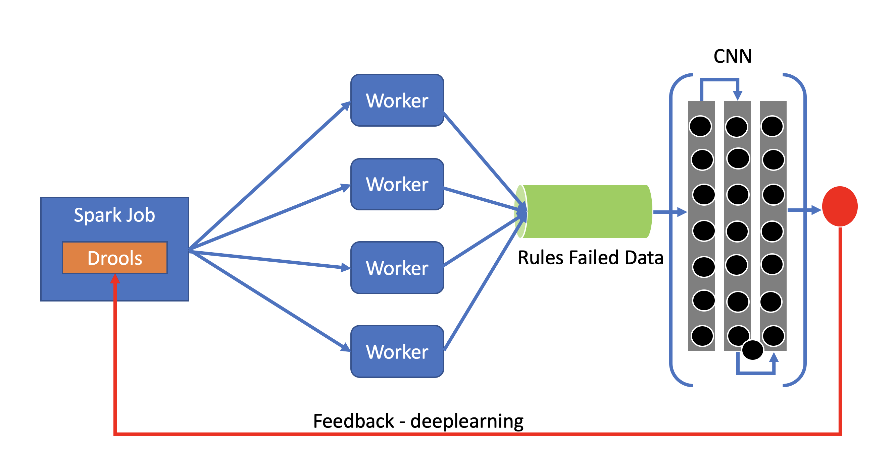

**Spark Job with Drools As A Service**

A micro service which trigger a Spark Job which utilizes Drools rules
engine. The rules are distributed to all the worker nodes of Spark using
Broadcast variables.

**_Compile & Test:_**

mvn clean install

**_Run_**

java -jar target/spark-drools.jar

_**Swagger API**_

http://localhost:8080/swagger-ui.html

_**Self Learning System**_

